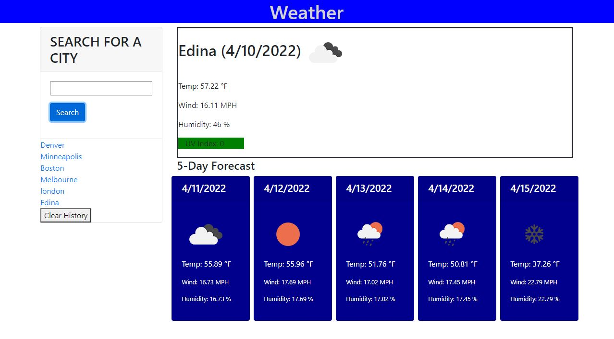

Weather Dashboard

This webpage allows for the user to search a city by name, and returns the weather for that city.  The data returned includes current weather, and weather forecast for the next 5 days.  The site uses a third-party API to access weather data by location.  The site also saves searches, creating a history list of previous searches that utilizes local storage to allow for the history to regenerate every time the webpage is loaded.  The history list is comprised of link elements that allow the user to click on the city name, which in return will load the weather data for that city.  

The site has features built in to account for a user trying to search for nothing (i.e. blank city input), as well as for a user typing in an incorrect city spelling or a city name that does not exist.  

The site follows the following conditions:
GIVEN a weather dashboard with form inputs
WHEN I search for a city
THEN I am presented with current and future conditions for that city and that city is added to the search history
WHEN I view current weather conditions for that city
THEN I am presented with the city name, the date, an icon representation of weather conditions, the temperature, the humidity, the wind speed, and the UV index
WHEN I view the UV index
THEN I am presented with a color that indicates whether the conditions are favorable, moderate, or severe
WHEN I view future weather conditions for that city
THEN I am presented with a 5-day forecast that displays the date, an icon representation of weather conditions, the temperature, the wind speed, and the humidity
WHEN I click on a city in the search history
THEN I am again presented with current and future conditions for that city

## Final Application

You can find the deployed workday scheduler [here](https://bmavetz.github.io/Weather_Dashboard/) 

An image of the deployed webpage is shown below:

